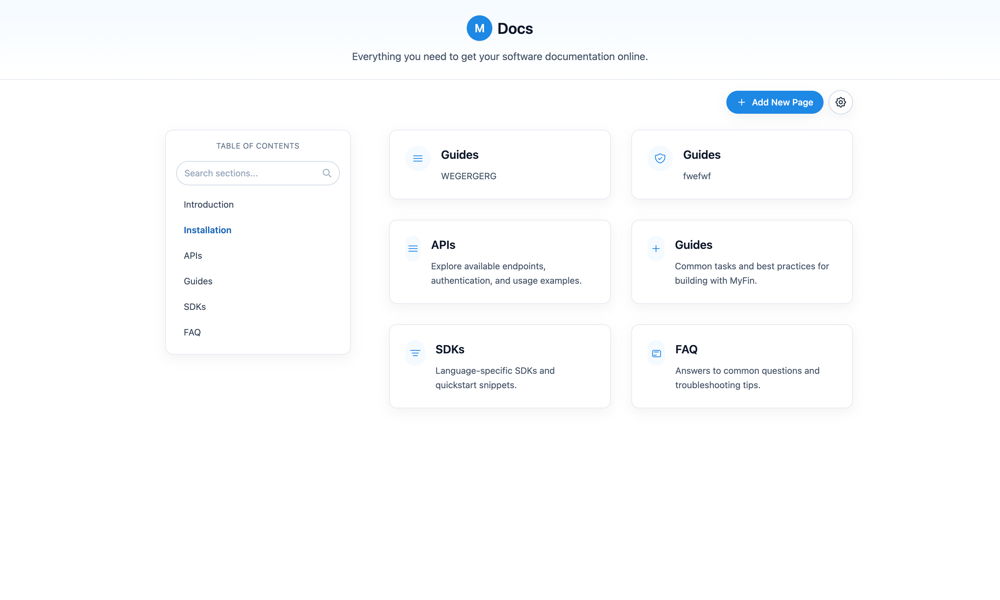
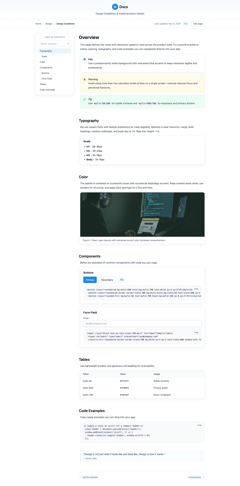
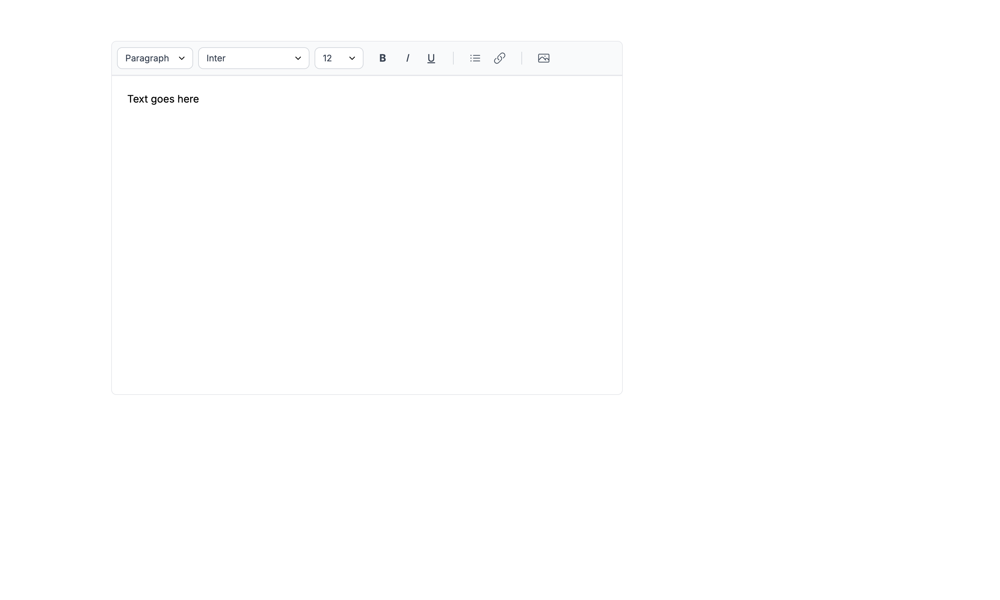

<p align="center">
  <a href="https://github.com/stephen-costa20/CoreDocs"></a>
  <a href="https://github.com/stephen-costa20/CoreDocs/blob/main/LICENSE"></a>
  <a href="https://github.com/stephen-costa20/CoreDocs/commits/main"></a>

</p>

# ⭐ CoreDocs - Django Documentation App

A modular Django application designed to support dynamic, wiki-style documentation pages with rich text content, routing, and an extensible structure. This project is intentionally being built in phases, with a clear separation between frontend templates and Django backend logic during early development.


## Important Architectural Note (Read This First)

🚧 **Current State vs. Planned Integration**

At present:

- The HTML templates in this repository are **static** and **not yet wired into Django template tags, context variables, or views**
- Django is being used as the **backend foundation**, but the UI is intentionally developed in isolation first

This is **by design**, not an omission.

### Why this approach?
The development plan is:

1. **Phase 1 – UI & UX First (Current)**
   - Design and refine clean, reusable HTML templates
   - Validate layout, structure, and interaction patterns
   - Keep templates framework-agnostic during iteration

2. **Phase 2 – Django Integration**
   - Convert static templates to Django templates (``, ``, ``, context variables)
   - Bind templates to Django views
   - Connect models for dynamic page content
   - Enable routing, permissions, and database-backed documentation pages

3. **Phase 3 – Advanced Features**
   - Versioned documentation pages
   - Role-based editing permissions
   - Search and indexing
   - Markdown or rich-text editor integration

This phased approach allows faster iteration, cleaner architecture, and avoids premature coupling between frontend design and backend logic.


## Features (Planned / In Progress)

- Wiki-style documentation pages
- Modular Django app architecture
- Clean separation of concerns (UI vs backend)
- Extensible models for future enhancements
- Designed for safe public GitHub distribution


## Tech Stack

- Python 3.12+
- Django 5.x
- SQLite (development only)
- HTML / CSS (framework-agnostic templates in early phase)


## Project Structure

```text
backend/
├── apps/
│   └── documentation/
│       ├── migrations/
│       ├── templates/
│       ├── admin.py
│       ├── apps.py
│       ├── models.py
│       ├── urls.py
│       └── views.py
├── project_settings/
│   ├── settings.py
│   ├── urls.py
│   └── wsgi.py
├── manage.py
├── requirements.txt
└── .env.example
```


## Setup Instructions

### 1. Clone the Repository
```bash
git clone https://github.com/your-username/your-repo-name.git
cd your-repo-name
```

### 2. Create Virtual Environment
```bash
python -m venv .venv
source .venv/bin/activate  # macOS/Linux
.venv\Scripts\activate   # Windows
```

### 3. Install Dependencies
```bash
pip install -r requirements.txt
```

### 4. Configure Environment Variables
```bash
cp .env.example .env
```

Update `.env` with appropriate values.

### 5. Run Migrations
```bash
python manage.py migrate
```

### 6. Start Development Server
```bash
python manage.py runserver
```

Visit: http://127.0.0.1:8000/


## Environment Variables

| Variable | Description |
|--------|-------------|
| DJANGO_SECRET_KEY | Django secret key |
| DJANGO_DEBUG | Enable/disable debug mode |
| DJANGO_ALLOWED_HOSTS | Space-separated allowed hosts |


## Notes for Public Repositories

- Do **not** commit `.env` files
- Do **not** commit `db.sqlite3`
- Do **not** commit `.venv/`
- Use `.env.example` as a template


## Roadmap Ideas

- Django template integration
- Page version history
- Role-based access control
- Full-text search
- Analytics and edit tracking


---

## Screenshots

The following screenshots showcase the current **UI-first phase** of the project.  
All images are stored in the repository under:

```text
docs/screenshots/
```





> Note: These screenshots represent static templates during Phase 1.  
> As Django integration progresses, screenshots will be updated to reflect dynamic content and routing.

---

## Using the Makefile

This project includes a `Makefile.mak` to streamline common development tasks and enforce consistency across environments.

### Common Usage

Run any command using:

```bash
make -f Makefile.mak <command>
```

### Typical Commands

Examples (actual commands may vary depending on your Makefile):

```bash
make -f Makefile.mak setup        # Initial environment setup
make -f Makefile.mak install      # Install dependencies
make -f Makefile.mak migrate      # Run Django migrations
make -f Makefile.mak run          # Start the development server
make -f Makefile.mak clean        # Cleanup caches / temp files
```

Using the Makefile is optional, but recommended for:
- Faster onboarding
- Fewer setup mistakes
- Repeatable workflows across contributors

If you prefer manual commands, you can still follow the standard Django setup instructions above.


## License

MIT License
